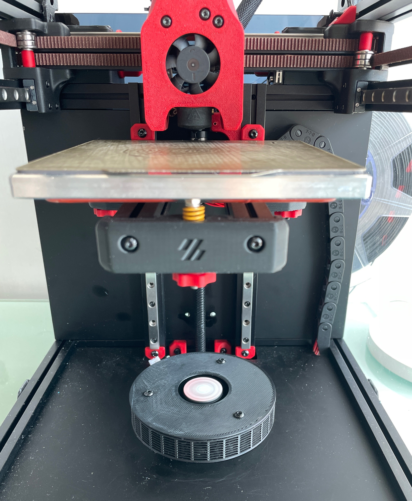

# FilterZero
Filter for 3d printers inspired by [NeverMore](https://github.com/nevermore3d/Nevermore_Micro). 

As the name suggests, the design goal is to be as simple as possible. It's basically just a fan surrounded by activated charcoals.

So why choose FilterZero?
- Small.
- Simplest possible airflow. 
- Easy assembly: 3 heat inserts and screws, no magnets.
- Easy installation: simply place it at the base of your printer, or virtically using a printed stand.

# CAD files
- zero.stl: the main filter body.
- cover.stl: the filter cover.
- (optional) stand.stl: You can tape it anywhere in your printer so that you can place your filter virtically.
- (optional) fan_cover_for_refilling.stl: when refilling, cover your fan so that the activated charcoal won't fall into the fan compartment.

# Assembly
BOM:
- 3 M3 heat inserts and M3*6 NHCS screws
- 3M VHB tape
- 24V or 5V 5015 fan, or smaller

Assembly should be pretty trivial. For how to prepare the fan etc, please read [NeverMore](https://github.com/nevermore3d/Nevermore_Micro).

A few comments:
- The small hole at the center of the filter is help you center the fan.
- The wire should go through the two holes at the bottom. You may need to desolder the wires from the fan for it to go through, then solder it back later.
- For wiring, I connect mine to the 24V PSU directly. You can be creative at how to wire yours.

# Installation
I just put it at the bottom of my Voron V0.1. I lose about 5mm Z from it, which I don't mind.

You can also put it vertically using the printed stand. It might be helpful to tape the stand somewhere so it won't move around.
